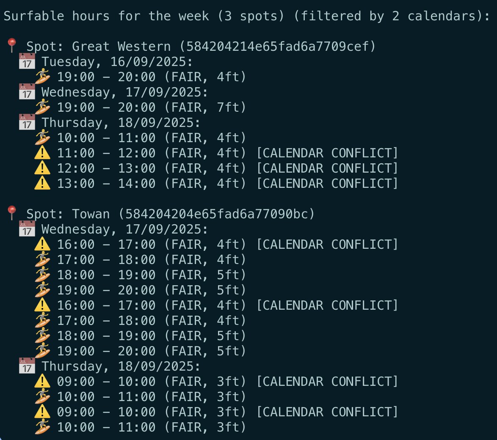

# Surfcal

🏄‍♂️ **Never miss the perfect wave again!** Surfcal is your intelligent surf forecasting companion that combines real-time Surfline data with your Google Calendar to find the exact moments when epic surf conditions align with your free time.

Whether you're chasing dawn patrol sessions, planning weekend surf trips, or comparing conditions across multiple breaks, Surfcal delivers precise surfable hour predictions with smart calendar conflict detection. Get visual indicators for when great waves clash with meetings, so you can make informed decisions about rescheduling that Zoom call for overhead barrels!

✨ **Features that will revolutionize your surf planning:**

- 🌊 Real-time surf condition analysis from Surfline's premium data
- 💨 Comprehensive wind data including speed, direction, and onshore/offshore indicators
- 📅 Smart calendar integration that shows conflicts without hiding opportunities
- 🎯 Multi-spot comparisons to find the best waves in your area
- ⚙️ Configurable criteria for wave height and surf rating thresholds
- ☀️ Intelligent filtering to daylight hours only
- 🔮 7-day forecasting to plan your entire surf week

Example:

```
npx surfcal --spotId 584204214e65fad6a7709cef --spotId 584204204e65fad6a77090bc --spotId 584204204e65fad6a77090bc --week --wave-min 3 --rating-min FAIR --calendar personal@gmail.com --calendar work@employer.io
```



## Usage

### CLI Tool

After building, use the CLI tool directly. The tool now supports multiple surf spots and calendar integration for comprehensive condition checking:

```
surfcal [--spotId spotId1] [--spotId spotId2] ... [--calendar calendarId1] [--calendar calendarId2] ... [--wave-min feet] [--rating-min rating] [--today | --tomorrow | --week | --on dd/mm/yyyy]
```

### Available Options

- `--spotId`: Surf spot ID (can be used multiple times for comparing spots)
- `--calendar`: Google Calendar ID to filter out busy times (can be used multiple times)
- `--wave-min`: Minimum wave height in feet (default: 2)
- `--rating-min`: Minimum surf rating (default: POOR_TO_FAIR)
    - Valid ratings: VERY_POOR, POOR, POOR_TO_FAIR, FAIR, GOOD, VERY_GOOD
- `--today`: Get surfable hours for today
- `--tomorrow`: Get surfable hours for tomorrow
- `--week`: Get surfable hours for the next 7 days
- `--on dd/mm/yyyy`: Get surfable hours for a specific date

### Single Spot Examples

1. Get surfable hours for today:

   ```
   surfcal --spotId 5842041f4e65fad6a7708876 --today
   ```

2. Get surfable hours for tomorrow:

   ```
   surfcal --spotId 5842041f4e65fad6a7708876 --tomorrow
   ```

3. Get surfable hours for the next 7 days:

   ```
   surfcal --spotId 5842041f4e65fad6a7708876 --week
   ```

4. Get surfable hours for a specific date:
   ```
   surfcal --spotId 5842041f4e65fad6a7708876 --on 15/09/2025
   ```

### Custom Criteria Examples (NEW!)

The CLI now supports customizable surf criteria to match your preferences and skill level:

1. **Higher wave requirements** (for experienced surfers):

   ```
   surfcal --spotId 5842041f4e65fad6a7708876 --wave-min 4 --rating-min GOOD --today
   ```

2. **Lower wave requirements** (for beginners):

   ```
   surfcal --spotId 5842041f4e65fad6a7708876 --wave-min 1.5 --rating-min POOR --today
   ```

3. **Premium conditions only** (for epic sessions):

   ```
   surfcal --spotId 5842041f4e65fad6a7708876 --wave-min 6 --rating-min VERY_GOOD --week
   ```

4. **Combined with calendar integration**:
   ```
   surfcal --spotId 5842041f4e65fad6a7708876 --calendar work@company.com --wave-min 3 --rating-min FAIR --week
   ```

### Multiple Spot Examples (NEW!)

1. Compare conditions at multiple spots for today:

   ```
   surfcal --spotId 5842041f4e65fad6a7708876 --spotId 5842041f4e65fad6a7708815 --today
   ```

2. Check weekly conditions across multiple California spots:

   ```
   surfcal --spotId 5842041f4e65fad6a7708876 --spotId 5842041f4e65fad6a7708962 --week
   ```

3. Plan a surf trip for a specific date across multiple spots:
   ```
   surfcal --spotId 5842041f4e65fad6a7708876 --spotId 5842041f4e65fad6a7708815 --spotId 5842041f4e65fad6a770883d --on 20/09/2025
   ```

### Calendar Integration Examples (NEW!)

The CLI now supports Google Calendar integration to mark surfable hours that conflict with your meetings and appointments. Instead of hiding conflicted times, it shows ALL surfable hours with clear visual indicators for calendar conflicts!

1. **Single calendar integration:**

   ```
   surfcal --spotId 5842041f4e65fad6a7708876 --calendar benjamin.groehbiel@gmail.com --today
   ```

2. **Multiple calendars (work + personal):**

   ```
   surfcal --spotId 5842041f4e65fad6a7708876 --calendar work@company.com --calendar personal@gmail.com --week
   ```

3. **Multiple spots with calendar integration:**

   ```
   surfcal --spotId 5842041f4e65fad6a7708876 --spotId 5842041f4e65fad6a7708815 --calendar benjamin.groehbiel@gmail.com --tomorrow
   ```

4. **Plan a surf trip with calendar awareness:**
   ```
   surfcal --spotId 5842041f4e65fad6a7708876 --spotId 5842041f4e65fad6a7708962 --calendar work@company.com --calendar personal@gmail.com --on 20/09/2025
   ```

**Note:** Calendar integration requires the `GOOGLE_CALENDAR_API_KEY` environment variable. Without it, the tool works normally but won't show calendar conflict indicators.

### Popular Surf Spot IDs

- **Malibu** (California): `5842041f4e65fad6a7708876`
- **Pipeline** (Hawaii): `5842041f4e65fad6a7708815`
- **Bells Beach** (Australia): `5842041f4e65fad6a770883d`
- **Jeffreys Bay** (South Africa): `5842041f4e65fad6a7708962`

### Output Format

The CLI now provides enhanced output with:

- Clear spot identification (📍 emoji)
- Surfable hours grouped by spot
- Condition details (rating and wave height)
- **Comprehensive wind data** (NEW!)
- **Calendar conflict indicators** (NEW!)
- Hierarchical display for better readability

Example output without calendar integration:

```
Surfable hours for the week (2 spots):

📍 Spot: Malibu (5842041f4e65fad6a7708876)
  📅 Monday, 16/09/2025:
    🏄 08:00 - 09:00 (FAIR, 3.2ft) - Wind: 8 kts NW (offshore)
    🏄 15:00 - 16:00 (GOOD, 4.1ft) - Wind: 12 kts W (offshore)

📍 Spot: Pipeline (5842041f4e65fad6a7708815)
  📅 Monday, 16/09/2025:
    🏄 06:30 - 07:30 (VERY_GOOD, 5.8ft) - Wind: 15 kts NE (offshore)
```

Example output with calendar integration:

```
Surfable hours for today (1 spot) (filtered by 2 calendars):

📍 Spot: Malibu (5842041f4e65fad6a7708876)
  ⚠️ 10:00 - 11:00 (FAIR, 3.2ft) - Wind: 10 kts SE (onshore) [CALENDAR CONFLICT]
  🏄 14:00 - 15:00 (GOOD, 4.1ft) - Wind: 8 kts NW (offshore)
  🏄 17:00 - 18:00 (FAIR, 3.5ft) - Wind: 12 kts W (offshore)
  ⚠️ 19:00 - 20:00 (GOOD, 4.5ft) - Wind: 15 kts NW (offshore) [CALENDAR CONFLICT]
```

#### Visual Indicators:

- **🏄 Available**: No calendar conflicts - you're free to surf!
- **⚠️ Conflict**: Overlaps with calendar events - might need to reschedule meetings
- **[CALENDAR CONFLICT]**: Clear text indicator for conflicted times

When calendar integration is active, ALL surfable hours are shown with clear visual indicators so you can make informed decisions about your surf sessions.

If no valid command is provided, the tool displays usage information.

### MCP Server

Surfcal also provides an MCP (Model Context Protocol) server for AI-powered surf session scheduling. This allows AI agents like Claude to access surf condition data and integrate with calendar systems. The MCP server includes comprehensive wind data in all JSON responses for enhanced AI decision-making.

#### MCP Server Usage

1. **Start the MCP server:**

   ```
   npm run start:mcp
   ```

2. **Test the MCP server:**
   ```
   npm run test:mcp
   ```

#### MCP Integration (not verified yet)

#### 🤖 AI Agent Vision: The Future of Intelligent Surf Planning

The goal is to let the agent broker between Surfline and Google Calendar to find the best surf sessions for you.

**🧠 Examples:**

- _"There are 4ft waves at Malibu from 2-4pm, but you have a meeting from 3-4pm. Should I reschedule your meeting to catch these epic conditions?"_
- _"I found perfect dawn patrol conditions at Pipeline tomorrow 6-8am, and your calendar is free. Want me to book travel and block your calendar?"_
- _"Your usual surf spots are flat this week, but I found firing conditions at Jeffreys Bay. Should I check flight prices and move your meetings?"_

- This architecture keeps Surfcal focused on delivering the best surf forecasting data while enabling limitless AI-powered surf planning possibilities!

## Prerequisites

- Node.js version ^18.14.0 or ^20.0.0
- npm (comes with Node.js)

## Setup

1. Clone the repository:

   ```
   git clone git@github.com:bengro/surfcal.git
   cd surfcal
   ```

2. Install dependencies:

   ```
   npm install
   ```

3. Set up environment variables:
   Create a `.env` file in the project root or export the following variables in your shell:

   ```
   SURFLINE_EMAIL=your_surfline_email@example.com
   SURFLINE_PASSWORD=your_surfline_password
   GOOGLE_CALENDAR_API_KEY=your_google_calendar_api_key  # Optional for calendar integration
   ```

   - `SURFLINE_EMAIL` and `SURFLINE_PASSWORD` are required for authenticating with Surfline's API
   - `GOOGLE_CALENDAR_API_KEY` is optional and enables calendar integration features

## Build

Compile the TypeScript source code to JavaScript:

```
npm run build
```

This generates the `dist/` directory with compiled JavaScript files.

## Test

Run the test suite using Jest:

```
npm test
```

This executes all unit tests located in the `src/` directory.

## Linting

This project uses Prettier for code formatting. You can check for and fix linting issues using the following commands:

- To check for linting errors:

  ```
  npm run lint
  ```

- To automatically fix linting errors:
  ```
  npm run lint:fix
  ```

## Available Scripts

- `npm run build` - Compile TypeScript to JavaScript
- `npm start` - Run the CLI tool
- `npm run start:mcp` - Start the MCP server
- `npm test` - Run Jest tests
- `npm run test:mcp` - Test MCP server configuration
- `npm run lint` - Check code formatting
- `npm run lint:fix` - Fix code formatting issues

## License

ISC

## Disclaimer

This project was predominantly written by Cline/Gemini and Windsurf/Claude.
